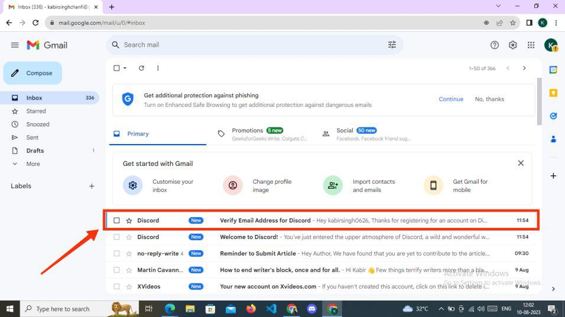
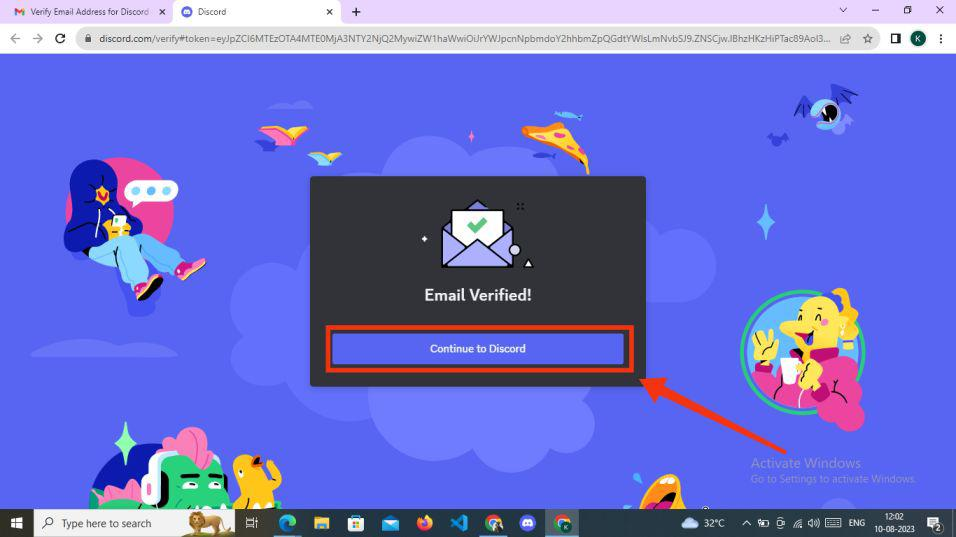
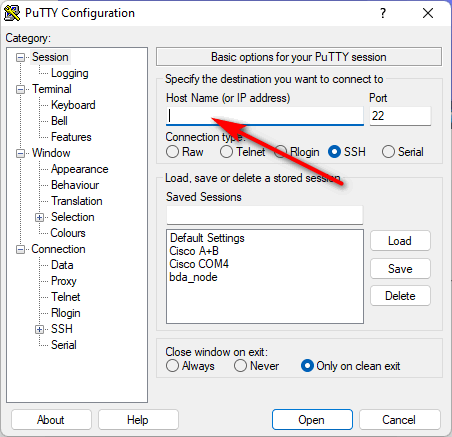

# CTF Participants Software Installation Manual 

For every Capture the Flag ( CTF ) participant, please check whether your laptop can match the minimum hardware requirement and please follow the software section to pre-install the program. 

[TOC]

------

### Hardware Requirement 

For each participant who attends the CTF event, he/she needs a laptop which can surf the internet via Wi-Fi, the laptop minimum hardware requirement spec are :

- Intel or AMD duel core 64-bit processor
- 4 GB RAM or higher
- At least one monitor with a resolution of 1024x768 or higher
- At least 5G free disk space or higher

------

### Software Requirement 

Please make sure the below software is installed in your laptop:

#### 2.1 laptop OS

- **Windows**: Windows 7+ or higher

- **Mac**:    MacOS 10.11 (El Capitan)+ or higher 

- **Linux**:  Ubuntu 18.04+ or Debian 10+ or openSUSE 16.2 or Fedora Linux 32+ or higher

  

#### 2.2 Web-Browser 

Participants need to use browser to access the CTF-D web ( https://ctfd.io/ ) to check and answer questions with any kind of web-browser below ( Click one of the link behind to download the browser installation file ) : 

- Google Chrome: [download link](https://www.google.com/chrome/?brand=YTUH&gclid=CjwKCAjws9ipBhB1EiwAccEi1PHX6wgH5QhgkXlj6ecC1FoDMJtuSfg-PWn1BTjlhJz6MtZ129VzyhoCp9AQAvD_BwE&gclsrc=aw.ds)
- Firefox 80+: [download link](https://www.mozilla.org/en-US/firefox/new/)
- Opera : [download link](https://www.opera.com/?utm_campaign=%2300%20-%20WW%20-%20Search%20-%20EN%20-%20Branded&utm_content=37670026502&gclid=CjwKCAjws9ipBhB1EiwAccEi1IBmrphS0fcAQt0EHNlMqcT5pA8cCXsXwEfeVk_LSydhH_EXcFVv1BoC6SIQAvD_BwE)
- Microsoft Edge 17+ (including Chromium Edge 79+ on Windows and macOS) : [download link](https://www.microsoft.com/en-us/edge/download?form=MA13FJ) 
- Safari 11+ (available on macOS 10.13 High Sierra and up) : [download link](https://www.apple.com/sg/safari/)

Before attend the CTF event, please make sure your team have created at least one account in the https://ctfd.io/. 

- To create a account, press the "sign up" button and use a valid email to create your account as shown below: 

#### 2.3 Discord Chat

Participants need to contact the support team for technical assistance via Discord chat tool, download the discord chat tool from this link: https://discord.com/download

Then follow below steps to register a Discord account: 

##### 2.3.1 Click “Login” Button

After you have visited the official Discord website, proceed to the upper right corner and select the “Login” button.

##### 2.3.2 Click on “Register” link

Upon reaching the welcome back screen, you will be prompted to log in using your current account. To create a new account on Discord, click on the “Register” option located below the Log In button.

##### 2.3.3 Add Your Basic Details and Click Continue

You need to complete the necessary information for creating a new account. This includes your email address, the display name you wish to use on your profile, your chosen Discord username, the password you want to set, and your date of birth. Once you’ve provided all the required information, click the “Continue” button to proceed to the next step.

##### 2.3.4 Confirm You are Not Robot

A box will now appear that requires confirmation before proceeding to the next step. Verify your human status and proceed to the following stage.

##### 2.3.5 Verify You Account

Upon reaching this stage, your Discord account has been successfully created. At the top of the Discord screen, you’ll notice a green tab prompting you to verify your Gmail account.

##### 2.3.6 Open Your Email and Click on Discord Verification Email

Next, access the email account you provided during the registration process. Look for the verification email sent by Discord in your inbox and click to open it.

##### 2.3.7 Click on “Verify Email”

Once you’ve opened the verification email from Discord, locate the “Verify Email” button and click on it.

##### 2.3.8 Click Continue to Discord

Your email has been successfully verified, and your Discord account is now ready to use. Simply click on the “Continue to Discord” button to begin using Discord.

#### 2.4 SSH Client (optional)

Participants may need to SSH login to the cloud instance to do some challenge tasks. They can use ssh command line or install one of below ssh clients: 

##### 2.4.1 Putty SSH Client

Download and install putty from link : https://www.putty.org/, select the installer which fit to your system:

After installed the Putty, assume the cloud instance ip address is xxx.xxx.xxx.xxx, fill in the ip address in the "Host Name" text field as shown below:

Then click the "Open" button to connect to the cloud instance.

##### 2.4.2 MobaXterm SSH Client

Download and install MobaXterm from link : https://mobaxterm.mobatek.net/, select the free version "Home Edition" : 

After install the MobaXterm, click the "Session" button at the top left conner, then select the SSH tab, assume the cloud instance ip address is xxx.xxx.xxx.xxx, fill in the ip address in the "remote host" text field, then fill in the user name as shown below:

Then click the "OK" button to connect to the cloud instance.

#### 2.5 Wireshark (Optional)

The participants may need to install the Wireshark on their local machine to analyze the network traffic packets to solve some forensics questions. The participants can go this download link: https://www.wireshark.org/download.html and select the installer which fit their system: 

------

> Last edit at 23/10/2023