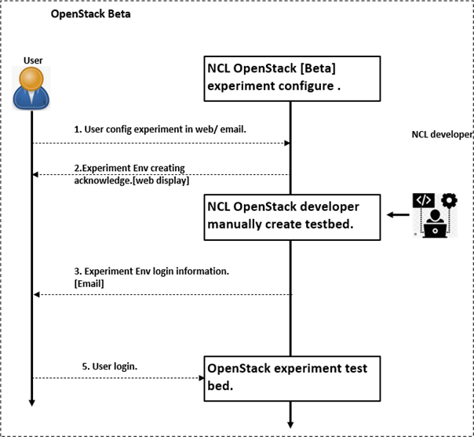
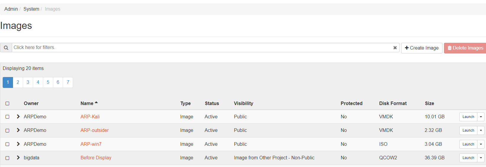
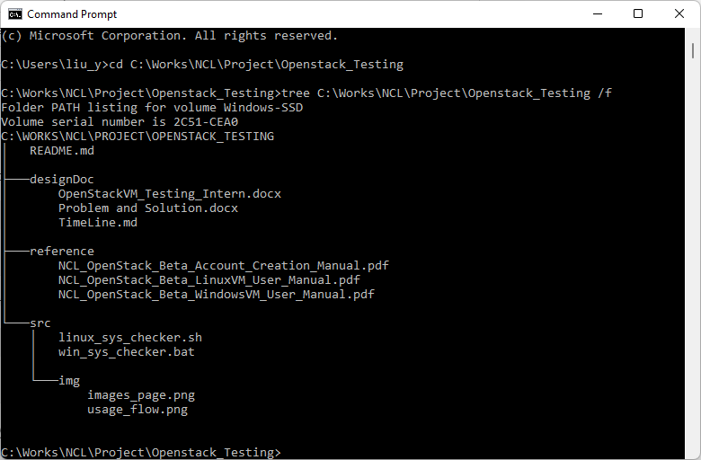

# OpenStack[Beta]_VM_Testing

**Project Design Purpose**:  This is an individual project assigned to NCL interns to test (or create) VM images in NCL OpenStack[Beta] provision system platform.

\{{TOC}}

### Introduction 

This assignment is an individual project which aims to let National Cybersecurity R&D Laboratory (NCL) interns pick up knowledge about OpenStack Infrastructure-as-a-Service (IaaS) clouds virtual servers provision system, get familiar with the OpenStack user platform, test all the public virtual machine image in NCL OpenStack [Beta] platform and create some OpenStack VM image which can be used by the NCL customers. 

**Project type**: `Program Testing`, `Individual project` 

##### NCL OpenStack [Beta] Usage Workflow 

##### NCL OpenStack Test bed Platform

Currently, NCL is using OpenStack to implement the cluster construction and provide the testbed platform service. NCL has several different levels of OpenStack service cluster for different kinds of users as shown below, and the intern will do this assignment on the Open stack[Beta].

- OpenStack [`Production`]: This platform is used for provide the testbed with large computing resource for the public users, mid size companies or cyber exercise host origination. 

- OpenStack [`Beta`]: This platform is used for providing the testbed/training platform for education/research usage purposes such as the CTF event host, NUS student/staff course assignment. 

- OpenStack [`Ironic`]: This platform is used for NCL internal users/developers to do the testing before deploying the new function to the production. 

The users can build their own (customized/standard) instance and install the OS image file in the instance to create a VM. The detail usage workflow of NCL OpenStack [Beta] is shown above. Currently the OpenStack Beta have 121 VM images stored in the OpenStack [Beta]. In the 121 VMs, 36 are public VM images which can be used by our customers. Some VM is converted from some customer’s uploaded private VM so current we need to figure out how many VMs in the 39 public VM image can work normally when our customers try to install them in their instance. 

NCL OpenStack [beta] testbed link: https://openstack.ncl.sg

NCL OpenStack [beta] Image list page: 

------

#### Project Files

The Intern need to finish and submit all these files for project evaluation:

| Project File                                   | Description                                      |
| ---------------------------------------------- | ------------------------------------------------ |
| designDoc/OpenStackVM_Testing_Intern.docx      | Improved assignment introduction document.       |
| designDoc/Problem and Solution.docx            | Project project and solution tracking document.  |
| designDoc/TimeLine.md                          | Project progress tracking doc.                   |
| designDoc/OpenStackVM_Testing_final_report.doc | Intern project final report.                     |
| designDoc/OpenStackVM_Testing_final_report.doc | Intern project final presentation.               |
| reference                                      | All learning material and reference doc.         |
| src/img                                        | screen shot and image folder                     |
| src/Linux_sys_checker.sh                       | Linux system information scan shell script.      |
| src/win_sys_checker.bat                        | Windows system information scan shell script.    |
| src/OpenStack_Beta_VM_manual.doc               | Openstack VM introduction manual                 |
| src/OpenStack_Image_creation_manual.doc        | Openstack VM introduction creation steps manual. |

------

### Assignment Main Task

##### Task 1: VM Image Testing.

This task is aiming to test all 36 public VM images in NCL OpenStack [Beta] platform and create a VM image manual. For each VM image, below contents are needed to list down: 

- VM type: Linux/Windows. (32bit/64bit)
- VM OS + version+ UI state: (ubuntu 18.04, CentOS)
- VM image CPU min limit config.
- VM image RAM min limit config
- VM image Hard disk min limit config. 
- VM remote access config. (Such as SSH/RDP/VNC enabled ?)
- VM login detail. (username/password)
- VM network interface config detail. (Such as network interface number, Ipv4 config: DHCP/Fix static)
- VM image lib/tool included: (openssl, python3.x, docker, g++ ...)

By checking the list for all the public VM, the customer can find the correct image with the login detail based on their requirement instead of sending message to NCL Biz-Team to ask these basic questions such what the VM log in password.

 Expected workload: `1.5 day/week, total 10 weeks.` 

 

##### Task 2: VM Image Creation.

After the intern has got familiar about the testing, they can try to create some VM images, such as some lite Linux OS for IOT: 

- raspberry pi OS: raspbian 32bit/64bit
- raspberry pi OS: noobs 32bit
- raspberry pi OS: Ubuntu 16/18/Lite
- raspberry pi OS: CentOS 6/7
- BeagleBone Black OS: Debian-C 
- BeagleBone Black OS: fedora

The intern will test the customized VM image upload and usage part in OpenStack[Beta] and create a report about the detail steps for how to build these images. The created VM images can be used in the future OT/IOT security testbed. 

 Expected work load: `0.5 day/week ,total 6 weeks`.

------

### Assignment Progress Track

##### Assignment **Final **Goal

After finished the assignment, the Intern student need to provide below document and program: 

- [x] Provide an Intern assignment proposal/time line plan.

- [x] Provide a VM image manual/dictionary to listed down all the VM detail information. 

- [x] Provide a Linus shell script to list down all the all the information about the OS/VM. 

- [x] Provide a Windows cmd script file to list down all the information about the windows VM.

- [ ] Provide more than 5 embedded VM image 

- [ ] Provide a manual about building a VM image. 

- [x] Provide a general report and presentation about the task implement. 

- [x] [Optional] Provide a knowledge sharing doc to share with other intern about the learning experience. 

##### Assignment Timeline/Milestone

The assignment is a 12 week period project. Project workload 1 day/ week. Below is the project timeline draft and we will do adjustment and change in the future. We may do a very short discussion every week and every month to track the project progress. 

| **Week Index** | **Task**                                                     |
| -------------- | ------------------------------------------------------------ |
| Week 1         | Improve the project design document; Create a project implement plan timeline document. (TimeLine.md); List down all the knowledge need to pick up. |
| Week 2         | Read and try the NCL document/OpenStack manual, pick up the related knowledge; |
| Week 3         | Start testing and continues knowledge learning if needed.    |
| Week 4-7       | Finish the task 1 the main testing part, Implement the test report.(OpenStackVM_Testing_final_report.doc) |
| Week 8-9       | Finish the task 2 VM image creation, Implement the VM creation manual. |
| Week 10-12     | Finish all the documents, Short presentation to the team.    |

------

### Reference 

The Intern can list down all the links/document he used for the project here:

- OpenStack Official web: https://www.openstack.org/

------

> Last edit by LiuYuancheng(liu_yuan_cheng@hotmail.com) at 06/05/2022